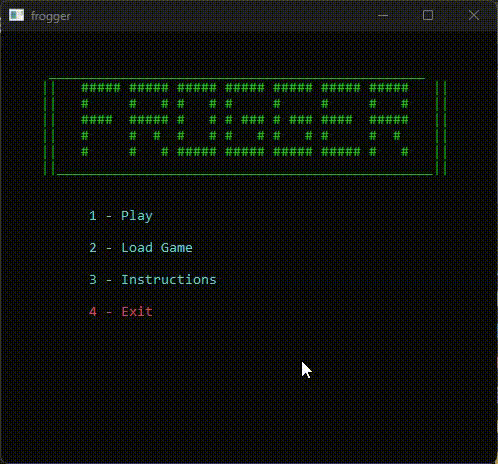

# Frogger

A complete Frogger clone written from scratch in C, rendered entirely with ASCII art in the Windows console — no game engine, no graphics library, no external dependencies.



Final project for **INF01202 – Algoritmos e Programação**, UFRGS, June 2015.

## What it does

- **Two hazard zones** — a five-lane road with cars moving in alternating directions, and a river crossed on drifting logs and diving turtles.
- **Animated turtles** that surface, flash a warning, then submerge on a 140-frame cycle. Stand on one at the wrong moment and you drown.
- **Ride-along physics** — the frog is carried by whatever log or turtle it lands on, at that lane's speed and direction.
- **Five difficulty levels**, each scaling every object's speed by 10%.
- **Save and load** — press `Q` mid-run to write the full game state to disk and resume it later from the menu.
- **Score, lives, and win/lose states** with ASCII title, victory and game-over screens.

## Build and run

Requires a C compiler on Windows (MinGW/GCC). No libraries beyond the C standard library and the Win32 console API.

```bash
make
```

Or without make:

```bash
gcc -Wall -Wextra -O2 frogger.c -o frogger.exe
```

Then run `frogger.exe`. The game resizes the console to 62×27 on startup, so run it in its own window rather than an embedded terminal.

At runtime the game writes `phases.bin` (the level layout) and `save.txt` (your saved run) next to the executable. Delete either one and it is rebuilt from the defaults.

## Controls

| Key | Action |
| --- | --- |
| Arrow keys | Move the frog |
| `Q` | Save and quit |
| `1`–`4` | Menu: play / load / instructions / exit |

## How it works

The interesting part of this project is that everything a game engine would normally provide had to be built by hand:

- **Fixed-timestep game loop** — the loop targets 30 FPS, measuring elapsed time with `clock()` and sleeping off the remainder so gameplay speed does not depend on machine speed.
- **Software rendering into a character matrix** — every frame clears a `26 × 61` `char` buffer, composites each sprite into it, and then draws the whole buffer in one pass with the cursor reset to the origin instead of clearing the screen. This is what keeps the animation flicker-free.
- **Collision detection by sampling the framebuffer** — rather than tracking bounding boxes for every object, the game reads back the characters underneath the frog. On the road, any non-blank character is a car; in the river, a `~` means open water and death. Sprite art and hitboxes are therefore the same data, which keeps them from drifting apart.
- **Per-cell color** — each character is colored at draw time through the Win32 console attribute API based on what it represents.
- **Data-driven levels** — each lane is one `GAME_DATA` record in `phases.bin`: object type, length, spacing, how many share the lane, signed speed, and where it starts. Car sprites are then generated at whatever length the data asks for. A file that is missing, stale or malformed is rejected whole and rewritten from the defaults, never half-loaded.
- **Persistence** — saved runs are plain text: game state on the first line, then one line per lane.

Objects occupy two console columns per game unit, so the horizontal grid is half the console width. Sprites are two rows tall, which is why the frog moves vertically in steps of two.
